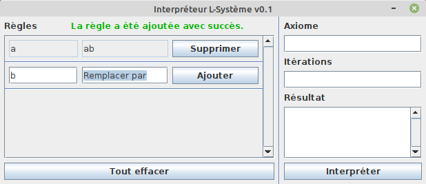

# L-Système

## Auteur
[David Brousseau](mailto:dbrsseau@gmail.com)

## Mentions des ressources utilisées
- [Tree Drawing, green tree, leaf, branch, plant Stem png](https://www.pngwing.com/en/free-png-zflyc)
- [Chasing Hearts Font](https://www.1001fonts.com/chasing-hearts-font.html)

## Contexte académique
Projet effectué dans le cadre du cours **INF2120 Programmation II**, remis à l'enseignant **Bruno Malenfant** à l'[Université du Québec à Montréal](https://etudier.uqam.ca/) le 10 décembre 2017. Ce projet a été retranscris en décembre 2020 pour le rendre public et l'insérer dans mon porte-folio.

## Description
Conception d'une application Java qui permet la réécriture d'un ou plusieurs symboles suivant les règles d'un [L-Système](https://fr.wikipedia.org/wiki/L-Syst%C3%A8me). À noter que cette application ne comprend pas d'exécutable et que vous devez la lancer via votre éditeur de texte.

## Environnement suggéré
- [VS Code](https://code.visualstudio.com/), éditeur de texte pour modifier le code.
- [Java Extension Pack](https://marketplace.visualstudio.com/items?itemName=vscjava.vscode-java-pack), extension du language Java réservé à l'usage de VS Code.
- [TODO Highlight](https://marketplace.visualstudio.com/items?itemName=wayou.vscode-todo-highlight), extension d'affichage des TODOs réservé à l'usage de VS Code.
- [JDK 11](https://openjdk.java.net/projects/jdk/11/), version de Java Development Kit pour compiler le code.

## Compatibilité
Testé sous des environnements **Linux** et **Windows**.

## Fonctionnement

Le fonctionnement de cette application est plutôt simple lorsqu'on connaît les bases d'un L-Système. Il suffit d'insérer les règles à suivre dans les cases à cet effet et d'entrer l'axiome de départ suivi du nombre d'itération. Le résultat s'affiche lorsqu'on appuie sur le bouton interpréter pour réécrire les symboles selon les règles ajoutées.

## Références
- [Intro to L-systems](https://morphocode.com/intro-to-l-systems/)
- [Trail: Creating a GUI With JFC/Swing](https://docs.oracle.com/javase/tutorial/uiswing/)
- [SWING Tutorial](https://www.tutorialspoint.com/swing/index.htm)
- [La gestion dynamique des objets et l'introspection](https://www.jmdoudoux.fr/java/dej/chap-introspection.htm#introspection-3)
- [Difference between validate(), revalidate() and invalidate() in Swing GUI](https://stackoverflow.com/questions/9510125/difference-between-validate-revalidate-and-invalidate-in-swing-gui)
- [What are the differences between paint() method and repaint() method in Java?](https://www.tutorialspoint.com/what-are-the-differences-between-paint-method-and-repaint-method-in-java)